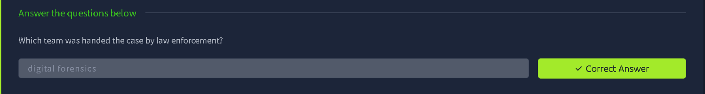
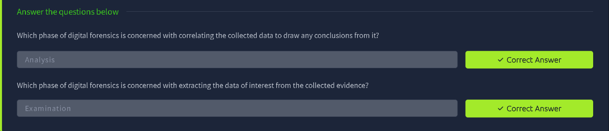
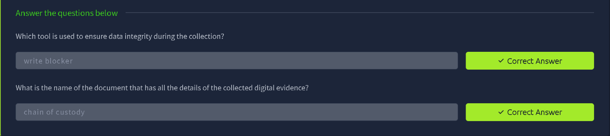
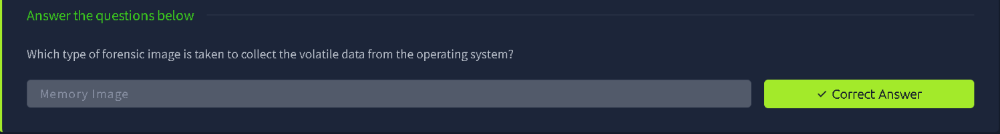
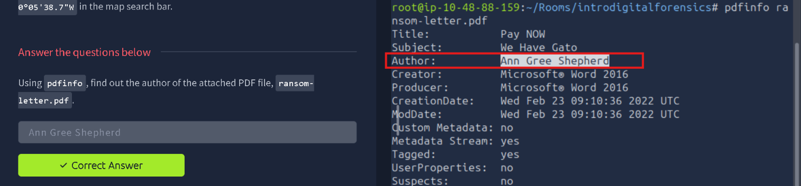
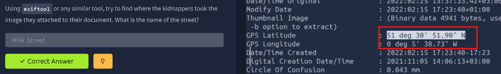
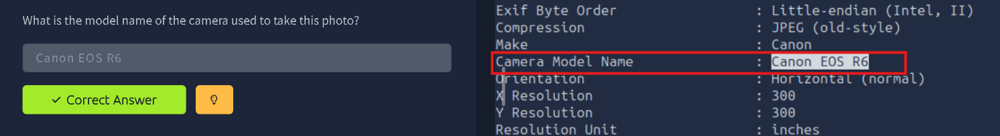

# TryHackMe — Digital Forensics Fundamentals

> **Track:** Cyber Security 101 → Defensive Security
> **Difficulty:** Easy · **Time:** ~60 min
> **Focus:** The digital forensics process (collection → analysis), evidence integrity, and a hands-on metadata investigation (`pdfinfo`, `exiftool`)


Digital forensics turns electronic evidence into something that can stand up in an investigation — or a courtroom. This room covers the formal process, the tools that protect evidence integrity, and then applies both to a scenario: a kidnapping case, worked purely through document and image metadata.

---

## Table of Contents
1. [The Case Handoff](#1-the-case-handoff)
2. [The Digital Forensics Phases](#2-the-digital-forensics-phases)
3. [Evidence Integrity: Write Blockers and Chain of Custody](#3-evidence-integrity-write-blockers-and-chain-of-custody)
4. [Forensic Image Types](#4-forensic-image-types)
5. [Hands-On: Investigating the Ransom Letter](#5-hands-on-investigating-the-ransom-letter)
6. [Hands-On: Tracing the Attached Photo](#6-hands-on-tracing-the-attached-photo)
7. [Key Takeaways](#7-key-takeaways)

---

## 1. The Case Handoff

The scenario opens with law enforcement handing off a case for electronic evidence analysis. The team that receives it: the **digital forensics** team — the specialists responsible for recovering, preserving, and analysing data in a way that holds up to later scrutiny.



---

## 2. The Digital Forensics Phases

Digital forensics follows a structured sequence of phases, two of which are easy to confuse:

- **Examination** is the phase concerned with **extracting the data of interest** from the collected evidence — pulling out what's actually relevant from a much larger pool of raw data.
- **Analysis** is the phase concerned with **correlating the extracted data** to draw conclusions from it — connecting individual pieces of evidence into a coherent picture.



In short: **Examination finds the pieces, Analysis assembles them into a story.**

---

## 3. Evidence Integrity: Write Blockers and Chain of Custody

Two controls exist specifically to keep evidence legally and technically sound:

- A **write blocker** is the tool used to ensure data integrity during collection — a hardware or software device that allows read access to a storage medium while physically preventing any write operation, so the original evidence can never be altered during acquisition.
- The **chain of custody** is the document that records every detail of the collected digital evidence — who collected it, when, how it was handled, and every subsequent transfer — establishing an unbroken, auditable trail from collection to presentation.



---

## 4. Forensic Image Types

Different evidence sources call for different image types. The type taken specifically to capture **volatile data from a running operating system** — data that would be lost on power-off, like running processes, open network connections, and RAM contents — is a **Memory Image**.



---

## 5. Hands-On: Investigating the Ransom Letter

The practical case: a kidnapping, with a ransom letter (`ransom-letter.pdf`) as the primary piece of digital evidence. The first step is pulling the document's embedded metadata with `pdfinfo`:

```bash
pdfinfo ransom-letter.pdf
```

The output reveals the file's `Title`, `Subject`, `Creator`, `Producer`, creation and modification timestamps — and critically, the **`Author`** field, which names who actually created the document in Microsoft Word, regardless of what the letter itself claims.



**Why it matters:** attackers (or, in this case, kidnappers) often forget that the files they create carry embedded authorship metadata — a detail invisible in the rendered document but trivially readable by anyone who inspects the file properly.

---

## 6. Hands-On: Tracing the Attached Photo

The ransom letter also has an image attached. Metadata extraction with `exiftool` pulls GPS coordinates straight out of the photo's EXIF data:

```bash
exiftool attached-photo.jpg
```

The `GPS Latitude` and `GPS Longitude` fields resolve to a specific real-world location — pasted into a map search bar, this pins down the exact street where the photo was taken.



The same `exiftool` output also exposes the **camera model** used to take the photo, under the `Camera Model Name` field — a **Canon EOS R6** — adding another concrete, traceable detail to the investigation.



---

## 7. Key Takeaways

- **Examination vs Analysis is a sequencing distinction worth remembering**: you can't correlate evidence (Analysis) before you've pulled out what matters from it (Examination).
- **Write blockers and chain of custody exist for the same reason**: an investigation is only as strong as its evidence's integrity — if either breaks down, the evidence (and the conclusions drawn from it) can be challenged.
- **Metadata is often the richest source of evidence in a document** — far more revealing than the document's visible content. `pdfinfo` and `exiftool` turned a vague ransom letter into a named author and a precise GPS-traceable location, entirely from fields never meant to be read.
- **GPS EXIF data in photos is a persistent, frequently overlooked leak** — any image shared without stripping metadata can expose exactly where and (via camera model) potentially with what device it was taken.
- This case shows the full arc in miniature: collect the evidence, examine it with the right tools, and analyse what comes out to build an actionable conclusion.

---

*Room completed on 8 October 2026 as part of the Cyber Security 101 path.*
